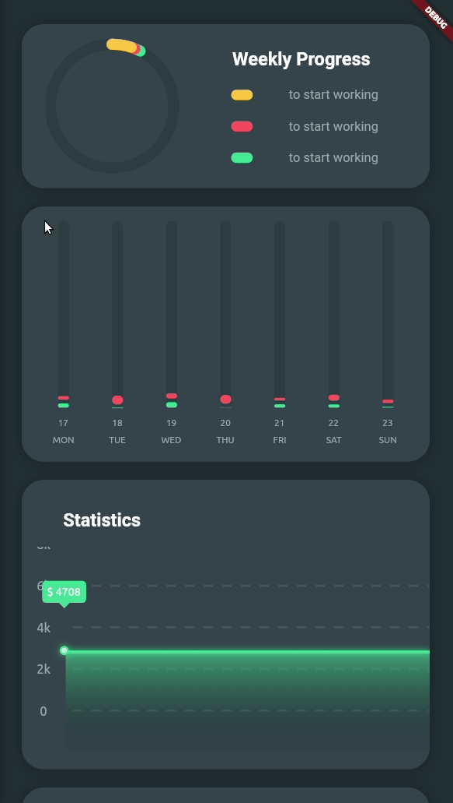

# flutter_charts_mockup

Flutter project implementing the graphs from the Figma design available
[here](https://dribbble.com/shots/10904459-Marvie-iOS-App-UI-Kit-Dark-Theme?ref=uistore.design).

## CustomPainter Subclasses

The core of this library revolves around several `CustomPainter` subclasses,
which are used to draw various chart components. These subclasses include:

- **Primitives**: Basic shapes such as `Circles`, `Pills`, and `ArcedPills` that
  serve as building blocks for more complex charts.
- **Charts**:
  - `AlternatingBarChart`: A bar chart with alternating colors.
  - `CurrencyChart`: A chart designed to display currency trends.
  - `FilledLineChart`: A line chart with filled areas.
  - `FixedOverlappingArcChart`: A chart with overlapping arcs.
  - `NestedArcChart`: A chart with nested arcs.
  - `ProgressBar`: A customizable progress bar.
  - `StackedBarChart`: A bar chart with stacked segments.
  - `WeekPeriodBarChart`: A bar chart representing weekly periods.

## Documentation

Code documentation is available
[here](https://tyler-conrad.github.io/doc/flutter_charts_mockup/).

## Web Demo

A demo of the application is available
[here](https://tyler-conrad.github.io/flutter_charts_mockup/).

## Tested on

- macOS Sequoia 15.1
- Flutter 3.24.0 • channel stable • https://github.com/flutter/flutter.git
- Framework • revision 80c2e84975 (2 weeks ago) • 2024-07-30 23:06:49 +0700
- Engine • revision b8800d88be
- Tools • Dart 3.5.0 • DevTools 2.37.2
